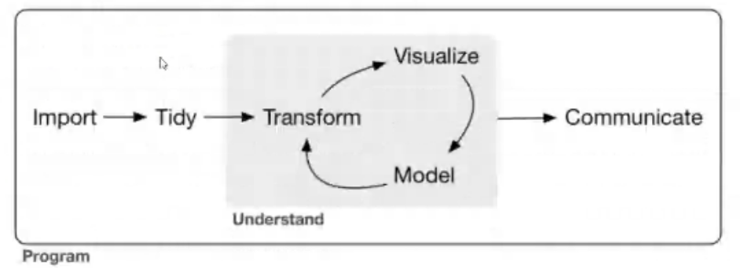
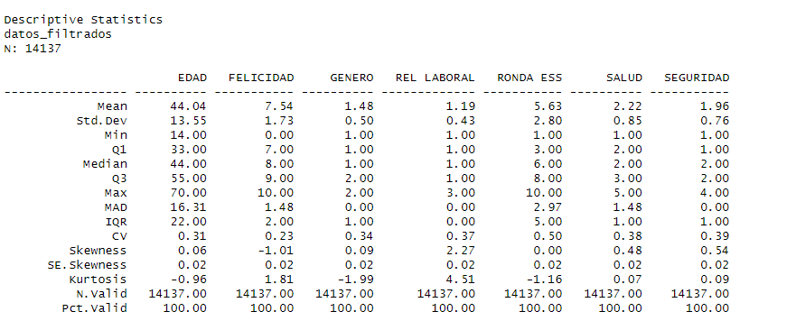

  <h1 style="font-size: 4em;">Exit-To</h1>

# Ejercicio de Reproducibilidad de un proyecto de Ciencia de Datos

## INTRODUCCION

Recordamos el modelo propuesto por Wickham y Grolemund (2017):

En este proyecto presentamos un panel con información sobre la relación entre el bienestar subjetivo de las personas y otras variables como son el género, el tipo de relación laboral y el territorio, en España.
Disponemos de datos de 10 rondas descargados del ESS Survey (https://www.europeansocialsurvey.org/data/) sobre indicadores sociodemográficos solo para España.

## OBJETIVOS
### Objetivos del Proyecto
El objetivo de este proyecto de ciencia de datos es analizar y visualizar la relación entre el bienestar subjetivo, medido a través de las variables felicidad, salud y seguridad, y las variables sociodemográficas rel_laboral, género y territorio. Utilizando datos de la Encuesta Social Europea (ESS), se busca identificar patrones y tendencias que puedan ofrecer una comprensión más profunda de cómo estos factores influyen en la percepción del bienestar de los individuos.
Se encuentran presentados en la primera página del panel.

##### Analizar el Bienestar Subjetivo:

Felicidad: Evaluar cómo la percepción de felicidad varía entre diferentes grupos demográficos y laborales.
Salud: Examinar la relación entre la autoevaluación de la salud y las variables sociodemográficas.
Seguridad: Investigar la percepción de seguridad y su variación según género, territorio y situación laboral.
Variables Sociodemográficas:

Relación Laboral (rel_laboral): Analizar cómo la situación laboral (empleado, autónomo, negocio familiar) se relaciona con las percepciones de felicidad, salud y seguridad.
Género: Estudiar las diferencias de bienestar subjetivo entre hombres y mujeres.
Territorio: Explorar cómo las diferencias geográficas (regiones en España) influyen en las percepciones de bienestar.

##### Identificación de Patrones y Tendencias:

Usar técnicas de análisis de datos y visualización para identificar y comunicar patrones significativos.
Proporcionar una base de datos clara y visualizaciones que permitan a los estudiantes y orientadores vocacionales comprender las interrelaciones entre estas variables.

# CARGA, DEPURACION Y FILTRADO INICIAL DE LOS DATOS

Existen tres ficheros R independientes que se ejecutan con la función source() desde el fichero Panel.rmd

## 1.Cargar_Datos_Brutos

Aunque nos habíamos planteado carga los datos desde la __ESS__, utilizando el usuario de la autora. Descartamos esta opción y se carga el fichero descargado previamente "ESS1e06_7-ESS2e03_6-ESS3e03_7-ESS4e04_6-ESS5e03_5-ESS6e02_6-ESS7e02_3-ESS8e02_3-ESS9e03_2-ESS10SC-subset.csv""
Hemos realizado una carga previa de los datos desde ESS con la url: 

Los datos se encuentran en el fichero:  

ESS1e06_7-ESS2e03_6-ESS3e03_7-ESS4e04_6-ESS5e03_5-ESS6e02_6-ESS7e02_3-ESS8e02_3-ESS9e03_2-ESS10SC-subset.csv

Y por facilidad creamos una copia para trabajar con ella llamada Datos_brutos.csv

Observo que R crea un fichero sin nombre con la extensión RData. Busco para qué sirve:

RData es un formato de archivo utilizado en el lenguaje de programación R para almacenar objetos R, como data frames, listas, matrices, vectores y más. Los archivos RData son útiles por varias razones:

1. **Almacenamiento Persistente**: Permiten guardar el estado actual del entorno de trabajo de R, incluyendo todas las variables y objetos, para que se puedan cargar y reutilizar en futuras sesiones sin tener que volver a crear o recalcular los objetos desde cero.

2. **Eficiencia de Espacio y Tiempo**: Los archivos RData pueden ser comprimidos, lo que reduce el espacio de almacenamiento necesario. Además, cargar un archivo RData es generalmente más rápido que volver a ejecutar el código para generar los objetos almacenados.

3. **Facilidad de Compartir y Reutilizar**: Facilitan compartir datos y resultados entre diferentes proyectos o colaboradores. Cualquier persona con el archivo RData puede cargarlo en su propio entorno R y acceder a los objetos contenidos en él.

Para mejorar la eficiencia al cargar datos brutos, por si ya están cargados, cargar un archivo RData en un proyecto de R, si podemos aplicar la mejora se utiliza una combinación de control de flujo con condiciones. 

1. **Verificación si los datos ya están cargados**:
2. **Cargar los datos de acuerdo a las condiciones**:

Con esta estructura, tu código podrá cargar datos de manera eficiente, asegurándose de no recargar datos si ya están disponibles en el entorno o en un archivo RData previamente guardado.
Aunque en este fichero solamente ejecutamos la carga de los datos, lo mantenemos de manera independiente por su posible evolución futura

## 2.Depuracion_datos

Dado que disponemos de un gran volumen de datos, procedemos a eliminar todas las filas con missing values que no podemos completar.

También generaremos un set de datos filtrados con el que generar gráficos más claros para su visualización.

Revisión de las distribuciones de los datos y la existencia de outliers:

VARIABLES DIRECTAS

En la tabla descriptiva observamos algunos outliers en determinadas variables como 
    • agea,  valores superiores a 100. 
    • aesfdrk, gndr, happy y health, valores fuera de la escala que representan que la persona encuestada no ha querido utilizar ninguno de los valores de la escala. No eliminamos pero si filtraremos para crear los análisis y gráficos correspondientes .
Revisamos los datos para crear un subset de datos filtrados.
Filtramos y renombramos las variables para una mejor legibilidad.

Agrupamos las columnas age y agea
Agrupamos regiones y regioaes
Añadimos una columna año en función del año de la ronda ESS, nos parece una variable de más fácil manejo para el usuario
Observamos que algunas rondas no disponen de datos sobre la region y generamos dos subconjuntos de datos, con o sin información sobre la región por si posteriormente es de utilidad.
Generamos un subset de datos llamado __datos_panel__ con las variables que utilizaremos en el panel interactivo y proseguimos con la limpieza de datos.

## 3.Descripción de los datos_panel_filtrados

Eliminamos los outliers para obtener datos descriptivos significativos que faciliten la visualización en el panel

FELICIDAD <= 10
RELACION LABORAL <= 3
EDAD <= 70
GENERO != 9
SEGURIDAD <=4
SALUD <= 5

y generamos el subset de datos: datos_panel_filtrados con el que trabajaremos para las tablas, análisis y gráficos.

Creamos varios subconjuntos de datos para trabajar con ellos en el panel

Datos filtrados, filtrados con region y sin region.

En el caso de la tabla dinámica del Panel, hemos tenido que genera un subset de dtos más reducido para una mejor carga del mismo. Se trata de datos_tabla_region_categoricos

DATOS FILTRADOS

## Referencias

#### Paquetes de R utilizados

# CRAN -----------------------------------------------------------------------
- abind               [* -> 1.4-5]
- askpass             [* -> 1.2.0]
- backports           [* -> 1.5.0]
- base64enc           [* -> 0.1-3]
- bit                 [* -> 4.0.5]
- bit64               [* -> 4.0.5]
- bitops              [* -> 1.0-7]
- blob                [* -> 1.2.4]
- boot                [* -> 1.3-30]
- brew                [* -> 1.0-10]
- brio                [* -> 1.1.5]
- broom               [* -> 1.0.6]
- bslib               [* -> 0.7.0]
- cachem              [* -> 1.1.0]
- callr               [* -> 3.7.6]
- car                 [* -> 3.1-2]
- carData             [* -> 3.0-5]
- caTools             [* -> 1.18.2]
- cellranger          [* -> 1.1.0]
- checkmate           [* -> 2.3.1]
- class               [* -> 7.3-22]
- cli                 [* -> 3.6.3]
- clipr               [* -> 0.8.0]
- cluster             [* -> 2.1.6]
- codetools           [* -> 0.2-20]
- colorspace          [* -> 2.1-0]
- commonmark          [* -> 1.9.1]
- corrplot            [* -> 0.92]
- cowplot             [* -> 1.1.3]
- cpp11               [* -> 0.4.7]
- crayon              [* -> 1.5.3]
- credentials         [* -> 2.0.1]
- crosstalk           [* -> 1.2.1]
- crul                [* -> 1.5.0]
- curl                [* -> 5.2.1]
- data.table          [* -> 1.15.4]
- DBI                 [* -> 1.2.3]
- dbplyr              [* -> 2.5.0]
- Deriv               [* -> 4.1.3]
- desc                [* -> 1.4.3]
- DescTools           [* -> 0.99.54]
- devtools            [* -> 2.4.5]
- diffobj             [* -> 0.3.5]
- digest              [* -> 0.6.36]
- doBy                [* -> 4.6.22]
- downlit             [* -> 0.4.4]
- dplyr               [* -> 1.1.4]
- DT                  [* -> 0.33]
- dtplyr              [* -> 1.3.1]
- e1071               [* -> 1.7-14]
- effects             [* -> 4.2-2]
- ellipsis            [* -> 0.3.2]
- estimability        [* -> 1.5.1]
- evaluate            [* -> 0.24.0]
- Exact               [* -> 3.3]
- expm                [* -> 0.999-9]
- extrafont           [* -> 0.19]
- extrafontdb         [* -> 1.0]
- fansi               [* -> 1.0.6]
- farver              [* -> 2.1.2]
- fastmap             [* -> 1.2.0]
- flexdashboard       [* -> 0.6.2]
- fontawesome         [* -> 0.5.2]
- fontBitstreamVera   [* -> 0.1.1]
- fontLiberation      [* -> 0.1.0]
- fontquiver          [* -> 0.2.1]
- forcats             [* -> 1.0.0]
- foreign             [* -> 0.8-87]
- Formula             [* -> 1.2-5]
- fs                  [* -> 1.6.4]
- gargle              [* -> 1.5.2]
- gdtools             [* -> 0.3.7]
- generics            [* -> 0.1.3]
- gert                [* -> 2.1.0]
- gfonts              [* -> 0.2.0]
- ggplot2             [* -> 3.5.1]
- ggpubr              [* -> 0.6.0]
- ggrepel             [* -> 0.9.5]
- ggsci               [* -> 3.2.0]
- ggsignif            [* -> 0.6.4]
- gh                  [* -> 1.4.1]
- gitcreds            [* -> 0.1.2]
- gld                 [* -> 2.6.6]
- glue                [* -> 1.7.0]
- googledrive         [* -> 2.1.1]
- googlesheets4       [* -> 1.1.1]
- GPArotation         [* -> 2024.3-1]
- gplots              [* -> 3.1.3.1]
- gridExtra           [* -> 2.3]
- gtable              [* -> 0.3.5]
- gtools              [* -> 3.9.5]
- haven               [* -> 2.5.4]
- highr               [* -> 0.11]
- HistData            [* -> 0.9-1]
- Hmisc               [* -> 5.1-3]
- hms                 [* -> 1.1.3]
- hrbrthemes          [* -> 0.8.7]
- htmlTable           [* -> 2.4.3]
- htmltools           [* -> 0.5.8.1]
- htmlwidgets         [* -> 1.6.4]
- httpcode            [* -> 0.3.0]
- httpuv              [* -> 1.6.15]
- httr                [* -> 1.4.7]
- httr2               [* -> 1.0.2]
- ids                 [* -> 1.0.1]
- ini                 [* -> 0.3.1]
- insight             [* -> 0.20.2]
- isoband             [* -> 0.2.7]
- jquerylib           [* -> 0.1.4]
- jsonlite            [* -> 1.8.8]
- kableExtra          [* -> 1.4.0]
- KernSmooth          [* -> 2.23-24]
- knitr               [* -> 1.48]
- labeling            [* -> 0.4.3]
- later               [* -> 1.3.2]
- lattice             [* -> 0.22-6]
- lazyeval            [* -> 0.2.2]
- leaps               [* -> 3.2]
- lifecycle           [* -> 1.0.4]
- lme4                [* -> 1.1-35.5]
- lmom                [* -> 3.0]
- lobstr              [* -> 1.1.2]
- lorem               [* -> 1.0.0]
- lubridate           [* -> 1.9.3]
- magick              [* -> 2.8.4]
- magrittr            [* -> 2.0.3]
- maps                [* -> 3.4.2]
- MASS                [* -> 7.3-60]
- Matrix              [* -> 1.6-1.1]
- MatrixModels        [* -> 0.5-3]
- matrixStats         [* -> 1.3.0]
- memoise             [* -> 2.0.1]
- mgcv                [* -> 1.9-1]
- microbenchmark      [* -> 1.4.10]
- mime                [* -> 0.12]
- miniUI              [* -> 0.1.1.1]
- minqa               [* -> 1.2.7]
- mitools             [* -> 2.4]
- mnormt              [* -> 2.1.1]
- modelr              [* -> 0.1.11]
- munsell             [* -> 0.5.1]
- mvtnorm             [* -> 1.2-5]
- nlme                [* -> 3.1-165]
- nloptr              [* -> 2.1.1]
- nnet                [* -> 7.3-19]
- nortest             [* -> 1.0-4]
- numDeriv            [* -> 2016.8-1.1]
- openssl             [* -> 2.2.0]
- pander              [* -> 0.6.5]
- patchwork           [* -> 1.2.0]
- pbkrtest            [* -> 0.5.3]
- pillar              [* -> 1.9.0]
- pkgbuild            [* -> 1.4.4]
- pkgconfig           [* -> 2.0.3]
- pkgdown             [* -> 2.1.0]
- pkgload             [* -> 1.4.0]
- plyr                [* -> 1.8.9]
- polynom             [* -> 1.4-1]
- praise              [* -> 1.0.0]
- prettyunits         [* -> 1.2.0]
- processx            [* -> 3.8.4]
- profvis             [* -> 0.3.8]
- progress            [* -> 1.2.3]
- promises            [* -> 1.3.0]
- proxy               [* -> 0.4-27]
- pryr                [* -> 0.1.6]
- ps                  [* -> 1.7.7]
- psych               [* -> 2.4.6.26]
- purrr               [* -> 1.0.2]
- quantreg            [* -> 5.98]
- R6                  [* -> 2.5.1]
- ragg                [* -> 1.3.2]
- rappdirs            [* -> 0.3.3]
- rapportools         [* -> 1.1]
- rcmdcheck           [* -> 1.4.0]
- RcmdrMisc           [* -> 2.9-1]
- RColorBrewer        [* -> 1.1-3]
- Rcpp                [* -> 1.0.13]
- RcppArmadillo       [* -> 14.0.0-1]
- RcppEigen           [* -> 0.3.4.0.0]
- readr               [* -> 2.1.5]
- readstata13         [* -> 0.10.1]
- readxl              [* -> 1.4.3]
- rematch             [* -> 2.0.0]
- rematch2            [* -> 2.1.2]
- remotes             [* -> 2.5.0]
- renv                [* -> 1.0.7]
- reprex              [* -> 2.1.1]
- reshape2            [* -> 1.4.4]
- rlang               [* -> 1.1.4]
- rmarkdown           [* -> 2.27]
- ROCR                [* -> 1.0-11]
- rootSolve           [* -> 1.8.2.4]
- roxygen2            [* -> 7.3.2]
- rpart               [* -> 4.1.23]
- rprojroot           [* -> 2.0.4]
- rstatix             [* -> 0.7.2]
- rstudioapi          [* -> 0.16.0]
- Rttf2pt1            [* -> 1.3.12]
- rversions           [* -> 2.1.2]
- rvest               [* -> 1.0.4]
- sandwich            [* -> 3.1-0]
- sass                [* -> 0.4.9]
- scales              [* -> 1.3.0]
- selectr             [* -> 0.4-2]
- sessioninfo         [* -> 1.2.2]
- shiny               [* -> 1.8.1.1]
- sourcetools         [* -> 0.1.7-1]
- SparseM             [* -> 1.84-2]
- stringi             [* -> 1.8.4]
- stringr             [* -> 1.5.1]
- summarytools        [* -> 1.0.1]
- survey              [* -> 4.4-2]
- survival            [* -> 3.7-0]
- svglite             [* -> 2.1.3]
- sys                 [* -> 3.4.2]
- systemfonts         [* -> 1.1.0]
- testthat            [* -> 3.2.1.1]
- textshaping         [* -> 0.4.0]
- tibble              [* -> 3.2.1]
- tidyr               [* -> 1.3.1]
- tidyselect          [* -> 1.2.1]
- tidyverse           [* -> 2.0.0]
- timechange          [* -> 0.3.0]
- tinytex             [* -> 0.52]
- triebeard           [* -> 0.4.1]
- tzdb                [* -> 0.4.0]
- urlchecker          [* -> 1.0.1]
- urltools            [* -> 1.7.3]
- usethis             [* -> 2.2.3]
- utf8                [* -> 1.2.4]
- uuid                [* -> 1.2-0]
- vctrs               [* -> 0.6.5]
- viridis             [* -> 0.6.5]
- viridisLite         [* -> 0.4.2]
- vroom               [* -> 1.6.5]
- waldo               [* -> 0.5.2]
- whisker             [* -> 0.4.1]
- withr               [* -> 3.0.0]
- xfun                [* -> 0.46]
- xml2                [* -> 1.3.6]
- xopen               [* -> 1.0.1]
- xtable              [* -> 1.8-4]
- yaml                [* -> 2.3.9]
- zip                 [* -> 2.3.1]
- zoo                 [* -> 1.8-12]

#### GitHub ---------------------------------------------------------------------
- conflicted          [* -> r-lib/conflicted@HEAD]

## Referencias bibliográficas

Los materiales del módulo 8 del curso de BDS, en particular:

Xie, Y. (2015). Dynamic documents with R and knitr (2nd ed.). Chapman and Hall/CRC.

#### Aprendizaje adquirido con este ejercicio de reproducibilidad

Diría que como ejercicio no he conseguido unos resultados óptimos. 
He aprendido muchísimo con este ejercicio.
Aunque no esté satisfecha con los resultados, la verdad es que sí me siento satisfecha con todo lo que he llegado a realizar en mi primer ejercicio con todas estas herramientas.
Me ha resultado muy útil, explorar en las versiones anteriores en el apartado COMMITS de GITHUB para encontrar dónde había empezado a fallar el código en la creación del fichero .ppt de la presentación.
He podido volver atrás y por eso he creado dos documentos por separado uno para la presentación en .ppt y otro en .html, porque no he conseguido un código capaz de ejecutar los dos simultáneamente.

